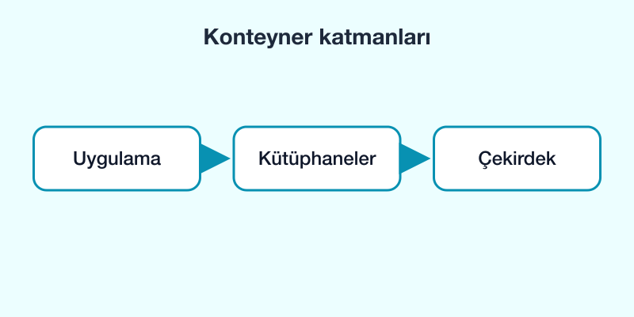

# Docker nedir?

Docker, bir uygulamayı ihtiyaç duyduğu her şeyle birlikte **konteyner** adı verilen yalıtılmış bir ortamda çalıştırmamızı sağlar.



## Neden kullanırız?

- "Benim bilgisayarımda çalışıyordu" sorununu azaltır.
- Geliştirme ortamını herkes için aynı yapar.
- Bir veritabanını kurmadan dakikalar içinde denemeyi sağlar.

```bash
docker --version
docker run hello-world
```

Sonraki part: [İlk konteyner](./part-2.md)
