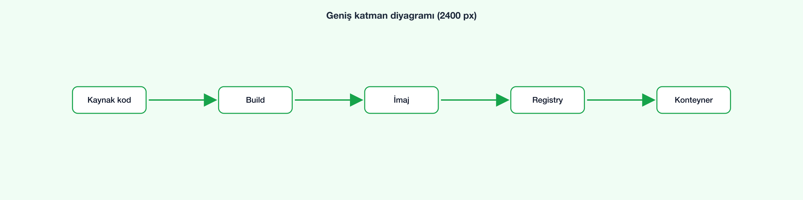

# Dockerfile ile kendi imajımız

Bir Spring Boot uygulamasını imaja dönüştürmek için kısa bir `Dockerfile`:

```dockerfile
FROM eclipse-temurin:25-jre
WORKDIR /app
COPY target/uygulama.jar app.jar
EXPOSE 8080
ENTRYPOINT ["java", "-jar", "app.jar"]
```

<details>
<summary>Ham HTML de güvenli biçimde desteklenir</summary>

Bu açılır bölüm ham HTML ile yazıldı. <kbd>Ctrl</kbd> + <kbd>C</kbd> gibi etiketler korunur;
<span onclick="alert('xss')">tıklama olayları</span> ve <script>alert('betik')</script> temizlenir.

</details>

Geniş bir görsel otomatik olarak küçültülür:



Önceki chapter: [İlk konteyner](../chapter-1/part-2.md#ilk-konteyner) · Tekrar için: [Neden kullanırız?](../chapter-1/part-1.md#neden-kullanırız)
