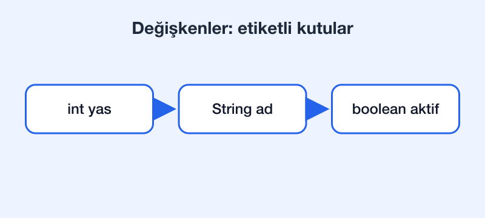

# Değişkenler ve tipler

Java'da her değişkenin bir tipi vardır. Tip, değişkenin hangi değerleri tutabileceğini ve bellekte nasıl saklanacağını belirler.



## İlkel tipler

| Tip | Boyut | Örnek |
| --- | --- | --- |
| `int` | 32 bit | `int yas = 27;` |
| `long` | 64 bit | `long nufus = 85_000_000L;` |
| `double` | 64 bit | `double oran = 0.75;` |
| `boolean` | — | `boolean aktif = true;` |
| `char` | 16 bit | `char harf = 'ş';` |

## Referans tipler

İlkel olmayan her şey bir **referans tiptir**. `String` bunun en bilinen örneğidir:

```java
String sehir = "Rize";
String selam = "Merhaba, " + sehir;
System.out.println(selam);
```

Aşağıdaki blok bir kod örneğidir; içindeki bağlantıya benzeyen metin değiştirilmemelidir:

```markdown
[Bu bir bağlantı değil, kod](./kosullar.md)

```

Satır içi kodda da aynı kural geçerli: `[metin](./kosullar.md)` olduğu gibi kalır.

## Sonraki adım

Koşullarla devam etmek için [Koşullar notuna](./kosullar.md) geç. Başlığa doğrudan gitmek de mümkün: [if-else bölümü](./kosullar.md#if-else).
